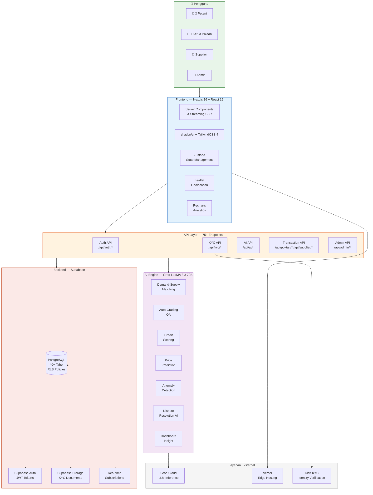
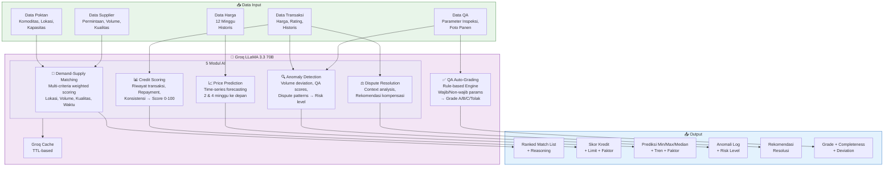
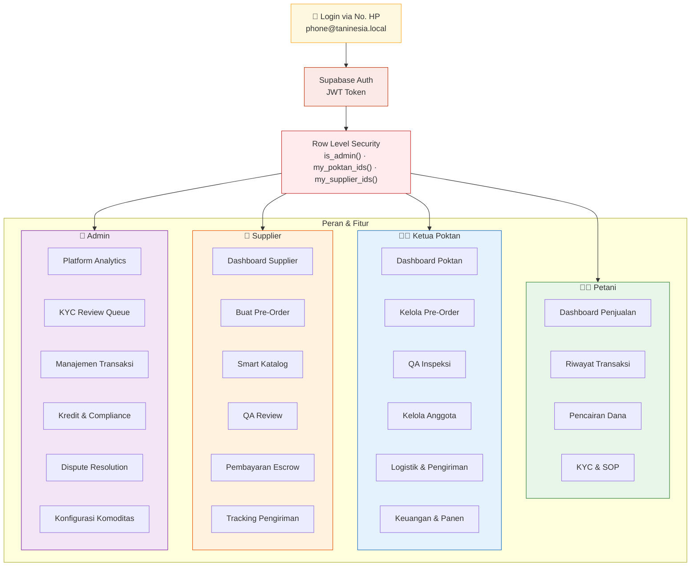
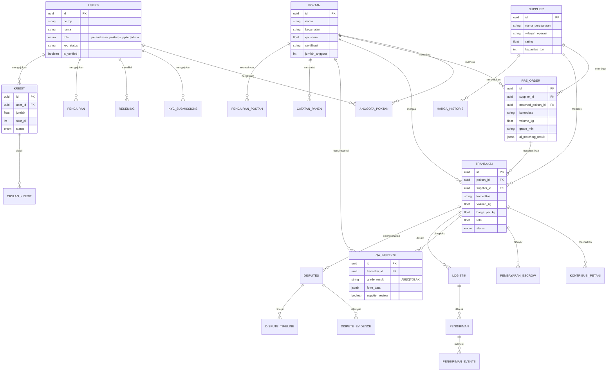
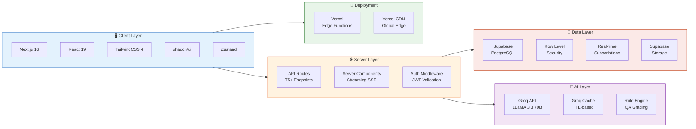

# Diagram Arsitektur Taninesia

> Render semua diagram di [mermaid.live](https://mermaid.live) atau export ke PNG/SVG untuk proposal.

---

## 1. Arsitektur Sistem (High-Level)

---

## 2. Alur Transaksi End-to-End

```mermaid
flowchart LR
    subgraph Phase1["📋 Registrasi"]
        R1["Poktan & Supplier\nMendaftar"]
        R2["KYC Verification\n3 Layer"]
        R3["SOP Agreement"]
    end

    subgraph Phase2["🔍 Matching"]
        M1["Supplier Buat\nPre-Order"]
        M2["AI Matching\nPoktan-Supplier"]
        M3["Smart Catalog\n& Harga"]
    end

    subgraph Phase3["💰 Transaksi"]
        T1["Negosiasi\n& Deal"]
        T2["Pembayaran\nEscrow"]
        T3["QA Auto-Grading\nA/B/C/Tolak"]
    end

    subgraph Phase4["🚚 Pengiriman"]
        L1["First Mile\nPoktan → Hub"]
        L2["Middle Mile\nHub → Hub"]
        L3["Last Mile\nHub → Supplier"]
    end

    subgraph Phase5["📊 Pasca-Transaksi"]
        P1["Settlement\n& Pencairan"]
        P2["Credit Scoring\nUpdate"]
        P3["Price Prediction\nUpdate"]
        P4["Trust Score\nUpdate"]
    end

    Phase1 --> Phase2 --> Phase3 --> Phase4 --> Phase5

    style Phase1 fill:#E8F5E9,stroke:#2E7D32
    style Phase2 fill:#E3F2FD,stroke:#1565C0
    style Phase3 fill:#FFF8E1,stroke:#F9A825
    style Phase4 fill:#FFF3E0,stroke:#E65100
    style Phase5 fill:#F3E5F5,stroke:#7B1FA2
```

---

## 3. Modul AI & Data Flow

---

## 4. Arsitektur Multi-Role & Hak Akses

---

## 5. Database Schema (Simplified ERD)

---

## 6. Tech Stack Overview

---

## Cara Render ke Gambar

1. **Mermaid Live Editor**: Buka [mermaid.live](https://mermaid.live), paste kode mermaid, lalu export PNG/SVG
2. **VS Code**: Install extension "Markdown Preview Mermaid Support"
3. **CLI**: `npx @mermaid-js/mermaid-cli mmdc -i DIAGRAMS.md -o output.png`

> Pilih diagram yang paling relevan untuk proposal, rekomendasi:
> - **Diagram 1** (Arsitektur Sistem) untuk gambaran umum
> - **Diagram 2** (Alur Transaksi) untuk cara kerja
> - **Diagram 3** (Modul AI) untuk technical approach
